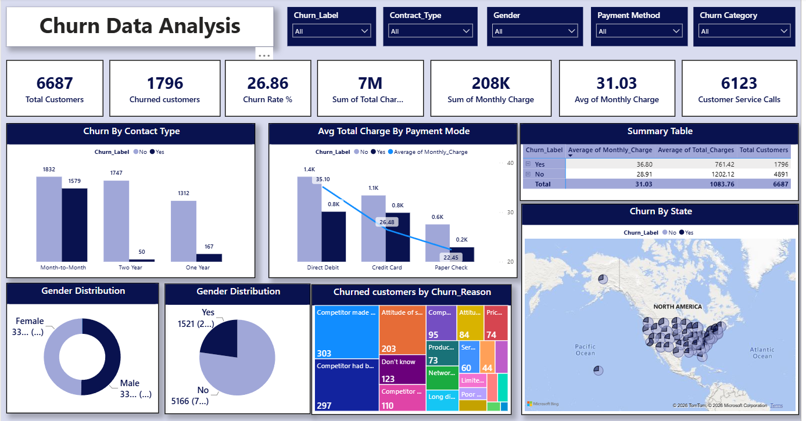

# 📊 Customer Churn Analysis Dashboard – Power BI

## 📌 Project Overview

This project is a **Customer Churn Analysis Dashboard** created using **Microsoft Power BI**.

The dashboard helps analyze customer churn, customer demographics, retention patterns and important business KPIs. It provides an interactive view of customer behavior and helps identify factors that may contribute to customer churn.

## 🎯 Objectives

* Analyze overall customer churn
* Identify churn rate and customer retention
* Understand customer demographics
* Analyze customer behavior and subscription patterns
* Identify important factors associated with customer churn
* Create an interactive dashboard for business decision-making

## 🛠️ Tools & Technologies

* **Microsoft Power BI**
* **Power Query**
* **DAX**
* **Data Cleaning & Transformation**
* **Data Visualization**

## 📊 Dashboard Features

The dashboard includes:

* Total Customers
* Churned Customers
* Churn Rate
* Customer Retention
* Customer Demographics
* Customer Segmentation
* Interactive Charts and Visualizations
* Filters and Slicers
* KPI Cards

## 🔍 Key Analysis

The dashboard can be used to analyze:

* Customer churn patterns
* Customer retention trends
* Demographic-wise churn
* Customer segments with higher churn
* Factors affecting customer retention

## 📷 Dashboard Preview

## 📁 Project Files

| File                              | Description             |
| --------------------------------- | ----------------------- |
| `Churn Dashboard.pbix`            | Power BI dashboard file |
| `screenshots-dashboard.png`       | Dashboard preview       |
| `README.md`                       | Project documentation   |

## 💡 Business Insights

This dashboard can help businesses:

* Identify high-risk customers
* Understand customer churn behavior
* Improve customer retention strategies
* Identify customer segments requiring attention
* Support data-driven business decisions

⭐ If you find this project useful, feel free to star the repository.
